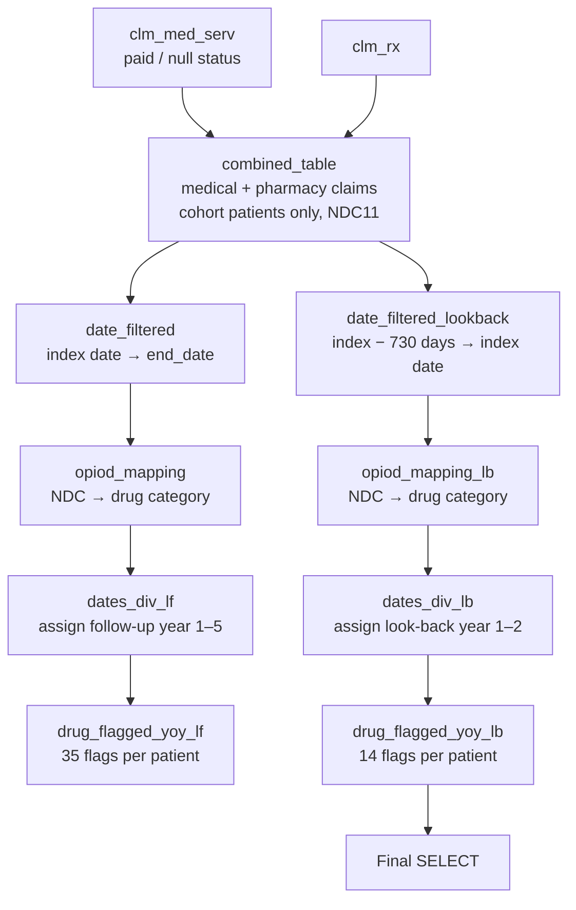

# Opioid & Related Analgesic Utilization Flags — Look-Back and Look-Forward Analysis
 
**Data source:** Optum Market Clarity — Sjögren's / Graves' Disease Cohort
**Schema:** `market_clarity_graves_disease_202505_v1_20250728_prod`
**SQL dialect:** Trino / Presto (e.g., AWS Athena) — uses `date_diff('day', …)` and `date_add('day', …)`
**Output grain:** One row per patient (`ptid`)
 
---
 
## 1. Purpose
 
This query measures whether patients in the Graves' disease analytic cohort (excluding patients flagged with sicca / Sjögren's features) received any of seven opioid or opioid-adjacent controlled analgesics, and *when* they received them relative to their first diagnosis date.
 
It produces two sets of binary patient-level flags:
 
| Analysis | Window | Granularity |
|---|---|---|
| **Look-back (pre-diagnosis)** | Up to 2 years (730 days) before the first diagnosis date, through the diagnosis date | 2 annual buckets |
| **Look-forward (post-diagnosis)** | From the first diagnosis date through the patient's end date, capped at 5 years | 5 annual buckets |
 
Typical business questions this supports: what share of patients were already using opioids before diagnosis, how opioid exposure changes year-over-year after diagnosis, and which molecules drive that exposure.
 
---
 
## 2. Data Sources
 
### 2.1 Source tables (Optum Market Clarity)
 
| Table | Content | Date field used | NDC field used |
|---|---|---|---|
| `argenx_graves_202505_clm_med_serv` | Medical / service claims (including drugs billed on the medical benefit, e.g., in-office administration) | `fst_dt` (first date of service), cast to `DATE` | `NDC` |
| `argenx_graves_202505_clm_rx` | Pharmacy (retail and mail-order) claims | `fill_dt` (fill date) | `ndc` |
 
The schema name indicates a **May 2025 data cut (`202505`), version 1, built 28 July 2025 (`20250728`)**, production environment. *(Inferred from the naming convention — confirm with the data engineering team.)*
 
### 2.2 Upstream dependencies (must exist before running)
 
| Object | Role | Required columns |
|---|---|---|
| `step4_flagged_without_sicca` | Final analytic cohort from Step 4 of the cohort build: Graves' patients after excluding those flagged for sicca syndrome / Sjögren's features | `ptid` |
| `temp_ap3` | Patient-level index and follow-up dates | `ptid`, `date_of_first_diagnosis`, `end_date` |
 
`date_of_first_diagnosis` acts as the **index date** for all calculations. `end_date` is the end of the patient's observable follow-up (for example, end of continuous enrollment or end of data availability — confirm the exact definition in the `temp_ap3` build script).
 
---
 
## 3. Processing Logic (Step by Step)
 

 
| Step (CTE) | What it does |
|---|---|
| `combined_table` | Stacks medical and pharmacy claims for cohort patients into one table with a common layout: `ptid`, `clm_date`, `ndc11`, `src` (`'CLM MED SERV'` or `'CLM RX'`). |
| `date_filtered` | Keeps claims dated between the first diagnosis date and the patient's end date (inclusive). |
| `opiod_mapping` | Assigns each claim to one of seven drug categories using hard-coded NDC lists; non-matching claims get `NULL`. |
| `dates_div_lf` | Assigns each post-index claim to follow-up year 1–5 based on days since diagnosis. |
| `drug_flagged_yoy_lf` | Rolls up to one row per patient with a 0/1 flag per drug × follow-up year. |
| `date_filtered_lookback` | Keeps claims dated from 730 days before diagnosis up to the diagnosis date (inclusive). |
| `opiod_mapping_lb` | Same NDC classification as above, applied to look-back claims. |
| `dates_div_lb` | Assigns each pre-index claim to look-back year 1 or 2 based on days before diagnosis. |
| `drug_flagged_yoy_lb` | Rolls up to one row per patient with a 0/1 flag per drug × look-back year. |
| Final `SELECT` | Currently returns **only the look-back flags** (see Section 7). |
 
---
 
## 4. Business Rules
 
**BR-01 — Cohort restriction.** Only patients present in `step4_flagged_without_sicca` are included. Both claim sources are filtered to this population before any other logic runs.
 
**BR-02 — Medical claim payment status.** Medical claims are kept when `PAID_STATUS` is `NULL` or equals `'P'` (Paid), after trimming whitespace and upper-casing. Denied, rejected, or other non-paid statuses are excluded. Null status is treated as valid to avoid dropping claims where the field is not populated.
 
**BR-03 — Pharmacy claim payment status.** No payment-status filter is applied to pharmacy claims; all records in `clm_rx` for cohort patients are used.
 
**BR-04 — NDC standardization.** All NDCs are converted to the 11-digit format by left-padding with zeros (`SUBSTR(CONCAT('00000000000', NDC), -11)`). For example, `527169501` becomes `00527169501`. Claims with a null NDC drop out of the classification step.
 
**BR-05 — Claim date.** The service date for medical claims is `fst_dt`; for pharmacy claims it is `fill_dt`. Days supply is not used, so a single 90-day fill counts only on the date it was filled.
 
**BR-06 — Index date.** The patient's `date_of_first_diagnosis` from `temp_ap3` is Day 0.
 
**BR-07 — Look-forward window and yearly buckets.** Claims from Day 0 through `end_date` are eligible. Each claim is placed in a 365-day bucket:
 
| Follow-up year | Days after diagnosis |
|---|---|
| Year 1 | 0 – 364 |
| Year 2 | 365 – 729 |
| Year 3 | 730 – 1,094 |
| Year 4 | 1,095 – 1,459 |
| Year 5 | 1,460 – 1,824 |
 
Claims after Day 1,824 fall outside all buckets and are not flagged.
 
**BR-08 — Look-back window and yearly buckets.** Claims from 730 days before diagnosis through Day 0 are eligible:
 
| Look-back year | Days before diagnosis |
|---|---|
| Year 1 (most recent) | 0 – 364 |
| Year 2 | 365 – 729 |
 
**BR-09 — Drug classification.** Claims are mapped to drug categories through fixed NDC lists (Section 5). The lists are identical in the look-forward and look-back steps. Classification is evaluated top-down in the order Butalbital → Carisoprodol → Codeine → Hydrocodone → Oxycodone → Propoxyphene → Tramadol, and the **first match wins**, so each claim receives at most one category.
 
**BR-10 — Flag definition.** A flag equals **1** if the patient has **at least one** claim for that drug category in that year bucket, and **0** otherwise. Flags indicate presence of use; they do not count claims, fills, or days of therapy.
 
---
 
## 5. Drug Categories
 
| Category | Column prefix | NDC codes in list | Notes |
|---|---|---|---|
| Butalbital | `butal_` | 71 | Barbiturate, mainly in combination headache products (with acetaminophen/aspirin/caffeine, some with codeine). Not an opioid itself. |
| Carisoprodol | `cariso_` | 46 | Centrally acting muscle relaxant (Schedule IV). Not an opioid; commonly included in opioid-risk analyses. |
| Codeine | `code_` | 119 | Includes single-agent and combination products (e.g., with acetaminophen). |
| Hydrocodone | `hydro_` | 286 | Includes combination products (e.g., with acetaminophen). |
| Oxycodone | `oxy_` | 273 | Immediate- and extended-release, single-agent and combinations. |
| Propoxyphene | `prop_` | 1 | Withdrawn from the US market in 2010; expect near-zero prevalence in recent data. |
| Tramadol | `trama_` | 110 | Includes single-agent and combination products. |
 
In total the lists contain 906 entries covering **896 unique NDCs**.
 
---
 
## 6. Output Specification
 
### 6.1 Look-back output (`drug_flagged_yoy_lb`) — currently returned
 
15 columns: `ptid` plus 14 flags.
 
| Column pattern | Meaning |
|---|---|
| `ptid` | Optum de-identified patient ID |
| `<drug>_lb_1` | 1 if any claim for the drug 0–364 days before diagnosis (including the diagnosis date) |
| `<drug>_lb_2` | 1 if any claim for the drug 365–729 days before diagnosis |
 
Example: `oxy_lb_2 = 1` means the patient had an oxycodone claim in the second year before diagnosis.
 
### 6.2 Look-forward output (`drug_flagged_yoy_lf`) — computed, not returned by default
 
36 columns: `ptid` plus 35 flags (7 drugs × 5 years).
 
| Column pattern | Meaning |
|---|---|
| `<drug>_lf_1` … `<drug>_lf_5` | 1 if any claim for the drug in follow-up year 1 … 5 after diagnosis |
 
Example: `hydro_lf_3 = 1` means the patient had a hydrocodone claim 730–1,094 days after diagnosis.
 
Drug prefixes for both tables: `butal`, `cariso`, `code`, `hydro`, `oxy`, `prop`, `trama`.
 
---
 
## 7. How to Run
 
1. Confirm that `step4_flagged_without_sicca` and `temp_ap3` exist in the current session or schema.
2. Run the script in a Trino / Presto / Athena environment with read access to the Market Clarity schema.
3. Choose the output you need by editing the last line:
```sql
-- Look-back flags (current default)
select * from drug_flagged_yoy_lb
 
-- Look-forward flags
select * from drug_flagged_yoy_lf
 
-- Both, one row per patient, including patients with no claims in either window
select c.ptid, lb.*, lf.*
from (select distinct ptid from step4_flagged_without_sicca) c
left join drug_flagged_yoy_lb lb on c.ptid = lb.ptid
left join drug_flagged_yoy_lf lf on c.ptid = lf.ptid
```
 
When using the combined version, drop the duplicate `ptid` columns from `lb.*` and `lf.*`, and treat nulls as 0 with `COALESCE` where appropriate.
 
---
 
## 8. Assumptions, Limitations, and Points for Review
 
These items affect how results should be read. Items marked **Action** are recommended for confirmation before results are shared.
 
**Output scope.** The final statement returns only look-back flags. The look-forward flags are calculated but are not part of the output unless the final `SELECT` is changed. **Action:** confirm which output the deliverable needs.
 
**Patient denominator.** Both windows use an inner join, so a patient appears in the output only if they have at least one claim of *any* kind (not just opioids) in that window. Cohort patients with no claims in the window are missing rather than shown with zeros. **Action:** use the cohort-based left join in Section 7 when calculating prevalence percentages.
 
**Zero does not always mean "not used."** A 0 in a look-forward year can mean either no qualifying claim or that the patient was no longer observed (their `end_date` fell before or during that year). The look-back logic does not check whether the patient was enrolled or observable during the 730 days before diagnosis. **Action:** add follow-up and pre-index eligibility flags (e.g., patient observable for the full year) so each year's denominator includes only patients who could be measured.
 
**Overlap between Butalbital and Codeine.** 10 NDCs appear in both lists (most likely butalbital/acetaminophen/caffeine/codeine combinations): `00054300001`, `00527131201`, `00591264101`, `00591322001`, `00591354601`, `00591354605`, `00603255321`, `51991007301`, `51991007401`, `69238199301`. Because the first match wins, these claims are counted as **Butalbital only**, which slightly understates codeine use. **Action:** decide whether these should count for both categories, which would require separate flag logic rather than a single `CASE`.
 
**Diagnosis-date claims count twice.** A claim on the exact diagnosis date falls in both look-back Year 1 and look-forward Year 1, because both windows include Day 0. **Action:** confirm whether index-day claims should belong to one period only.
 
**Look-back day 730.** The look-back window filter includes the claim dated exactly 730 days before diagnosis, but the bucket logic stops at 729 days, so that single day is not flagged. The effective look-back is 0–729 days.
 
**Pharmacy claims are not filtered on payment status** (BR-03). If `clm_rx` contains reversed or rejected fills, they are included. **Action:** confirm with the data dictionary whether reversals are already removed upstream.
 
**NDC standardization assumes digits only.** Left-padding converts 9- and 10-digit numeric values correctly, but NDCs stored with hyphens (e.g., `0527-1695-01`) or in a non-standard 10-digit segment layout would not convert correctly and would go unclassified. **Action:** spot-check NDC formats in both claim tables.
 
**Static NDC lists.** The NDC lists are hard-coded and repeated in two places. New products or labeler changes after the list was created will not be captured, and the two copies could drift apart if only one is edited. **Action:** move the NDC-to-category mapping into a single reference table, refreshed from a drug reference source each data cut.
 
**Use is based on dispensing and billing, not consumption.** A claim shows that a drug was dispensed or billed, not that it was taken. Cash-paid prescriptions and samples are not visible in claims data.
 
---
 
## 9. Suggested Quality Checks
 
1. **Row counts:** number of patients in the output vs. number of patients in `step4_flagged_without_sicca`.
2. **Source mix:** share of qualifying opioid claims from `CLM RX` vs. `CLM MED SERV` (pharmacy is expected to dominate).
3. **Prevalence sanity check:** proportion of patients with any flag per drug per year, compared with published US opioid prescribing rates for similar adult populations.
4. **Propoxyphene:** confirm counts are near zero; non-trivial counts would point to an NDC mapping issue.
5. **Unmapped NDCs:** list the most frequent NDCs that received a `NULL` category to confirm no relevant opioid products are being missed.
6. **Window check:** confirm no look-forward claim is before the diagnosis date or after `end_date`, and no look-back claim is more than 730 days before diagnosis.
---
 
## 10. Glossary
 
| Term | Definition |
|---|---|
| `ptid` | Optum de-identified patient identifier |
| NDC / NDC11 | National Drug Code; 11-digit standardized format (5-4-2) used for matching |
| Index date | Date of first Graves' disease diagnosis (`date_of_first_diagnosis`) |
| Look-back (LB) | Period before the index date |
| Look-forward (LF) | Period on or after the index date |
| Sicca | Dryness of eyes/mouth associated with Sjögren's syndrome; used upstream as an exclusion flag |
 
---
 
## 11. Document Control
 
| Field | Value |
|---|---|
| Owner | *TBD* |
| Reviewer | *TBD* |
| Data cut | May 2025 (`202505`), v1, built 2025-07-28 |
| Last updated | *TBD* |
